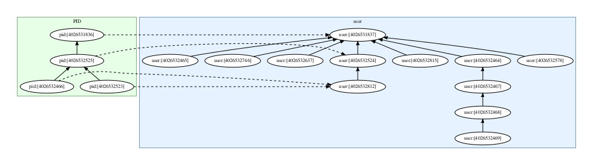

# Linux Kernel Namespace Relations

> **NOTE:** Python 3.6+ supported only

This Python 3 package allows discovering the following Linux Kernel
namespace relationships and properties, without having to delve into
`ioctl()` hell:

- the _owning_ user namespace of another Linux kernel namespace.
- the _parent_ namespace of either a user or a PID namespace.
- type of a Linux kernel namespace: user, PID, network, ...
- owner user ID of a user namespace.

See also [ioctl() operations for Linux namespaces](http://man7.org/linux/man-pages/man2/ioctl_ns.2.html)
for more background information of the namespace operations exposed by
this Python library.


# Installation

```bash
$ pip3 install linuxns-rel
```


# API Documentation

Please head over to our 
[linuxns_rel API documentation](https://thediveo.github.io/linuxns_rel/)
on GitHub Pages.


# CLI Examples

## List User Namespaces

```bash
$ lsuserns 
```

may yield something like this, a pretty hierarchy of Linux kernel user
namespaces:

```
user:[4026531837] owner root (0)
 ├── user:[4026532696] owner foobar (1000)
 ├── user:[4026532638] owner foobar (1000)
 ├── user:[4026532582] owner foobar (1000)
 │   └── user:[4026532639] owner foobar (1000)
 │       └── user:[4026532640] owner foobar (1000)
 │           └── user:[4026532641] owner foobar (1000)
 ├── user:[4026532466] owner foobar (1000)
 │   └── user:[4026532464] owner foobar (1000)
 ├── user:[4026532523] owner foobar (1000)
 └── user:[4026532583] owner foobar (1000)
```

If you have either Chromium or/and Firefox running, then these will
add some user namespaces in order to sandbox their inner workings. And
to add in some more hierarchical user namespaces, in another terminal
session simply issue the following command:

```bash
$ unshare -Ur unshare -Ur unshare -Ur unshare -Ur
```

Debian users may need to `sudo` because their distro's default
configuration prohibits ordinary users to create new user namespaces.

## List PID Namespaces

```bash
$ lspidns 
```

shows the PID namespace hierarchy, such as:

```
pid:[4026531836] owner user:[4026531837] root (0)
 └── pid:[4026532467] owner user:[4026532466] foobar (1000)
     ├── pid:[4026532465] owner user:[4026532464] foobar (1000)
     ├── pid:[4026532526] owner user:[4026532464] foobar (1000)
     └── pid:[4026532581] owner user:[4026532464] foobar (1000)
```

Don't worry that the PID namespace hierarchy doesn't match the user
namespace hierarchy. That's perfectly fine, depending on which programs
run. In our example, we didn't create new PID namespaces when using
`unshare`, so we see only additional PID namespaces created by
Chromium (Firefox doesn't create them though).

## Namespace Graph

Okay, with the famous `graphviz` installed (`apt-get install graphviz`)
now simply do:

```bash
$ lsnsgraph
```

...and you get something fancy with arrows, et cetera:



# Potentially FAQs

1. Q: Why do `get_userns()` and `get_parentns()` return file objects
   (`TextIO`) instead of filesystem paths?
   
   A: Because that's what the Linux namespace-related `ioctl()`
   functions are giving us: open file descriptors referencing namespaces
   in the special `nsfs` namespace filesystem. There are no paths
   associated with them.
   
2. Q: What argument types do `get_nstype()`, `get_userns()`,
   `get_parentns()`, and `get_owner_uid()` expect?
   
   A: Choose your weapon:
   - a filesystem path (name), such as `/proc/self/ns/user`,
   - an open file object (`TextIO`), such as returned by `open()`,
   - an open file descriptor, such as returned by `fileno()` methods.

3. Q: Why does `get_parentns()` throw an PermissionError?

   A: There are multiple causes:
   - you didn't specify a PID or user namespace,
   - the parent namespace either doesn't exist,
   - or the parent namespace is inaccessible to you,
   - oh, you really have no access to the namespace reference.
   
4. Q: Why does `get_userns()` throw an PermissionError?

   A: You don't have access to the owning user namespace.