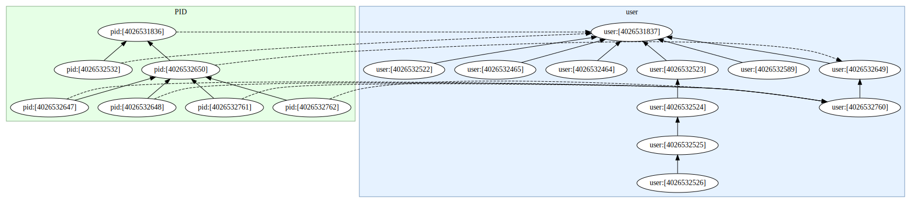

# Linux Kernel Namespace Relations

> **NOTE:** Linux Kernel 4.9+ and Python 3.5+ supported only

This Python 3 package allows discovering the following Linux Kernel
namespace relationships and properties, without having to delve into
`ioctl()` hell:

- the _owning_ user namespace of another Linux kernel namespace.
- the _parent_ namespace of either a user or a PID namespace.
- type of a Linux kernel namespace: user, PID, network, ...
- owner user ID of a user namespace.

See also [ioctl() operations for Linux namespaces](http://man7.org/linux/man-pages/man2/ioctl_ns.2.html)
for more background information of the namespace operations exposed by
this Python library.

## Installation

```bash
$ pip3 install linuxns-rel
```

> **NOTE:** the installation automatically detects Debian 9 Stretch and
> correctly handles installing the PyQt5 package, if it is missing, in
> at most version 5.10.1 -- as this is the last known working PyQt5
> release on Debian 9 Stretch.

## API Documentation

Please head over to our
[linuxns_rel API documentation](https://thediveo.github.io/linuxns_rel/)
on GitHub Pages.

## CLI Examples

> **NOTE:** Debian 9 Stretch users will lack the ability discover the
> owner user ID of hierarchical namespaces. The reason is that Debian
> 9 Stretch ships with outdated Linux kernels that lack the required
> Kernel functionality. Please enjoy this kind of _stability_. (Or is
> this "austerity"?)

### List User Namespaces

You can either use a simple `lsuserns` or `sudo lsuserns` -- the latter
ensures that you'll see _all_ user namespaces instead of only those you have
user access to. Optionally, you can also see which other namespaces are owned
by specific user namespaces.

> **NOTE:** `lsuserns` (and `lspidns`) discover user and pid namespaces from
> more locations than `lsns` does:
>
> - `/proc/$PID/ns/` (*the only location supported by `lsns`*)
> - `/proc/$PID/fd/` (open file descriptors referencing namespaces; only
>   `lsuserns` atm)
> - namespace `ioctl()` (see "man 2 ioctl_ns")

```bash
$ sudo lsuserns
```

may yield something like this, a pretty hierarchy of Linux kernel user
namespaces:

```text
user:[4026531837] process "init (1)" namespace-owning user "root" (0)
 ├── user:[4026532217] process "sleep (9403)" namespace-owning user "harald" (1000)
 ├── user:[4026532401] process "firefox (1374)" namespace-owning user "harald" (1000)
 ├── user:[4026532582] process namespace-owning user "harald" (1000)
 │   └── user:[4026532583] process namespace-owning user "harald" (1000)
 │       └── user:[4026532584] process namespace-owning user "harald" (1000)
 │           └── user:[4026532585] process "bash (1468)" namespace-owning user "harald" (1000)
 ├── user:[4026532639] process "firefox (2723)" namespace-owning user "harald" (1000)
 ├── user:[4026532696] process "firefox (2768)" namespace-owning user "harald" (1000)
 └── user:[4026532936] process "firefox (17192)" namespace-owning user "harald" (1000)
```

If you want to additionally see which non-user namespaces are owned by the user namespaces, then add the CLI arg `-d` (as in "details"):

```bash
$ sudo lsuserns -d
```

> **NOTE:** `-c` colorizes the output, differentiating namespaces in color
> based on their types.

In the output, "⟜" denotes a non-user namespace (ipc, mnt, net, ...) which is
owned by a particular user namespace.

```text
user:[4026531837] process "init (1)" namespace-owning user "root" (0)
 ├── ⟜ cgroup:[4026531835] process "init (1)"
 ├── ⟜ ipc:[4026531839] process "init (1)"
 ├── ⟜ mnt:[4026531840] process "init (1)"
 ├── ⟜ mnt:[4026531860] process "[kdevtmpfs] (57)"
 ├── ⟜ mnt:[4026532216] process "systemd-udevd (470)"
 ├── ⟜ mnt:[4026532263] process "systemd-resolved (1217)"
 ├── ⟜ mnt:[4026532264] process "systemd-timesyncd (1218)"
 ├── ⟜ mnt:[4026532452] process "haveged (1223)"
 ├── ⟜ mnt:[4026532453] process "ModemManager (1264)"
 ├── ⟜ mnt:[4026532454] process "NetworkManager (1268)"
 ├── ⟜ mnt:[4026532455] process "irqbalance (1312)"
 ├── ⟜ mnt:[4026532456] process "mpd (1402)"
 ├── ⟜ mnt:[4026532524] process "upowerd (1618)"
 ├── ⟜ net:[4026532000] process "init (1)"
 ├── ⟜ net:[4026532266] process "haveged (1223)"
 ├── ⟜ net:[4026532458] process "rtkit-daemon (2148)"
 ├── ⟜ pid:[4026531836] process "init (1)"
 ├── ⟜ uts:[4026531838] process "init (1)"
 ├── user:[4026532217] process "sleep (9403)" namespace-owning user "harald" (1000)
 │   └── ⟜ net:[4026532219] process "sleep (9403)"
 ├── user:[4026532401] process "firefox (1374)" namespace-owning user "harald" (1000)
 │   ├── ⟜ ipc:[4026532512] process "firefox (1374)"
 │   └── ⟜ net:[4026532529] process "firefox (1374)"
 ├── user:[4026532582] process namespace-owning user "harald" (1000)
 │   └── user:[4026532583] process namespace-owning user "harald" (1000)
 │       └── user:[4026532584] process namespace-owning user "harald" (1000)
 │           └── user:[4026532585] process "bash (1468)" namespace-owning user "harald" (1000)
 ├── user:[4026532639] process "firefox (2723)" namespace-owning user "harald" (1000)
 │   ├── ⟜ ipc:[4026532640] process "firefox (2723)"
 │   └── ⟜ net:[4026532642] process "firefox (2723)"
 ├── user:[4026532696] process "firefox (2768)" namespace-owning user "harald" (1000)
 │   ├── ⟜ ipc:[4026532697] process "firefox (2768)"
 │   └── ⟜ net:[4026532699] process "firefox (2768)"
 └── user:[4026532936] process "firefox (17192)" namespace-owning user "harald" (1000)
     ├── ⟜ ipc:[4026532937] process "firefox (17192)"
     └── ⟜ net:[4026532939] process "firefox (17192)"
```

If you have either Chromium or/and Firefox running, then these will
add some user namespaces in order to sandbox their inner workings. And
to add in some more hierarchical user namespaces, in another terminal
session simply issue the following command:

```bash
$ unshare -Ur unshare -Ur unshare -Ur unshare -Ur
```

Debian users may need to `sudo` because their distro's default
configuration prohibits ordinary users to create new user namespaces.

### List PID Namespaces

```bash
$ sudo lspidns 
```

shows the PID namespace hierarchy, such as:

```
pid:[4026531836] process "init" owner user:[4026531837] root (0)
 ├── pid:[4026532532] process "sh" owner user:[4026531837] root (0)
 └── pid:[4026532468] process "chromium-browser --type=zygote" owner user:[4026532467] foobar (1000)
     ├── pid:[4026532464] process "chromium-browser" owner user:[4026532589] foobar (1000)
     ├── pid:[4026532466] process "chromium-browser" owner user:[4026532589] foobar (1000)
     └── pid:[4026532590] process "chromium-browser" owner user:[4026532589] foobar (1000)
```

Don't worry that the PID namespace hierarchy doesn't match the user
namespace hierarchy. That's perfectly fine, depending on which programs
run. In our example, we didn't create new PID namespaces when using
`unshare`, so we see only additional PID namespaces created by
Chromium (Firefox doesn't create them though).

### Namespace Graph

Okay, with the famous `graphviz` installed (`apt-get install graphviz`)
now simply do:

```bash
$ sudo -E graphns
```

> Note: `-E` ensures that the graph viewer will correctly use the your
> desktop environment theme.

...and you get something fancy with arrows, et cetera, in a cute (_erm_,
"qute") little viewer window:



The view window supports these actions:

- mouse drag: move the visible area around inside the view window
  (usefull when either the graph is really large or when zoomed in).
- mouse wheel: zoom in/out.
- `+`/`-` keys: zoom in/out.
- `1` key: reset zoom to 1x.
- `s` key: save image to an SVG file.
- `q` key: close and exit the viewer.
- `h` key: show help on mouse and keys.

## Potentially FAQs

1. Q: Why do `get_userns()` and `get_parentns()` return file objects
   (`TextIO`) instead of filesystem paths?

   A: Because that's what the Linux namespace-related `ioctl()`
   functions are giving us: open file descriptors referencing namespaces
   in the special `nsfs` namespace filesystem. There are no paths
   associated with them.

2. Q: What argument types do `get_nstype()`, `get_userns()`,
   `get_parentns()`, and `get_owner_uid()` expect?

   A: Choose your weapon:
   - a filesystem path (name), such as `/proc/self/ns/user`,
   - an open file object (`TextIO`), such as returned by `open()`,
   - an open file descriptor, such as returned by `fileno()` methods.

3. Q: Why does `get_parentns()` throw an PermissionError?

   A: There are multiple causes:
   - you didn't specify a PID or user namespace,
   - the parent namespace either doesn't exist,
   - or the parent namespace is inaccessible to you,
   - oh, you really have no access to the namespace reference.

4. Q: Why does `get_userns()` throw an PermissionError?

   A: You don't have access to the owning user namespace.
